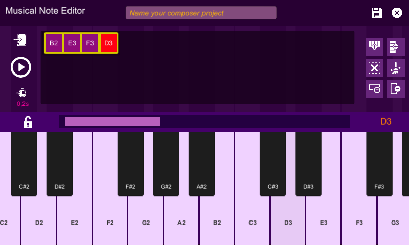

**Discover the World of Music with Piano MIDI – Where Your Melodies Come to Life!**

Are you passionate about music and brimming with unique melodies in your mind? **Piano MIDI** is your perfect companion, making it easier than ever to compose, store, and share your musical creations like never before!

### **Key Features**  
🎹 **Professional Music Composition**: Turn your ideas into complete masterpieces with an intuitive piano interface. Record each note and arrange them to create your signature sound effortlessly.  

🎵 **Multi-Instrument Integration**: Beyond the piano, the app features popular instruments like **drums**, **guitar**, **organ**, **violin**, and more. Each instrument is crafted to deliver an authentic and dynamic musical experience.  

📂 **Smart Storage and Management**: Save your compositions as **MIDI drafts**, enabling easy editing and export into popular audio formats whenever needed.  

🌟 **Inspire and Share**: With just a single tap, share your favorite compositions with friends or the wider music community. Spread the joy and inspiration of music to everyone around you.  

### **Modern Interface – Exceptional Experience**  
Designed with a **sleek and minimalist aesthetic**, the app offers a workspace that's both user-friendly and inspiring. Every action is optimized to ensure you stay focused on creating, free from any distractions.  

### **Music for Everyone**  
Whether you're a seasoned musician or just starting your musical journey, **Piano MIDI** is here to guide and support you. Embrace the freedom to experiment, create, and explore new horizons in music!  

### **Download Now!**  
Let **Piano MIDI** be your ultimate tool for crafting melodies that move the soul. Begin your musical adventure today – because music isn't just art; it's how we connect and share with one another.  

Are you ready to compose the soundtrack of your life? 🎼✨